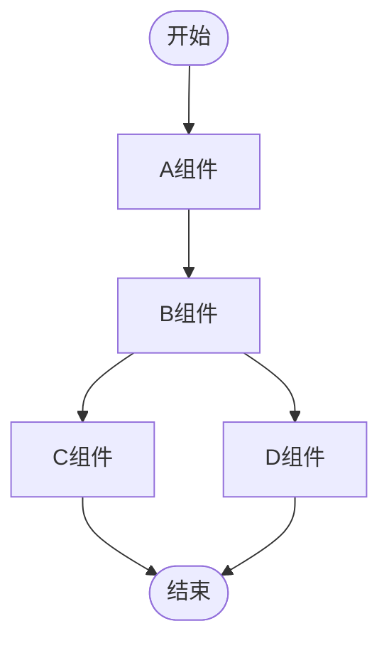

# myliteflow
我的liteflow

- liteflow1 普通的web项目
- liteflow2 THEN串行 WHEN并行

```mermaid
graph TD
	Start([开始]) --> A[A组件];
	A --> B[B组件];
	B --> C[C组件];
	B --> D[D组件];
	C --> End([结束]);
	D --> End;
```
liteflow官网
https://liteflow.yomahub.com/
